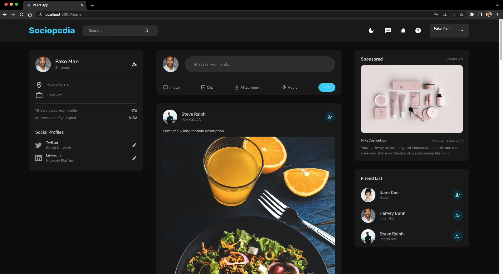
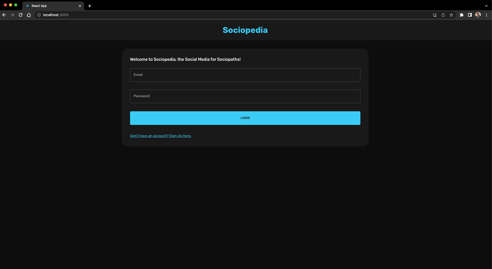
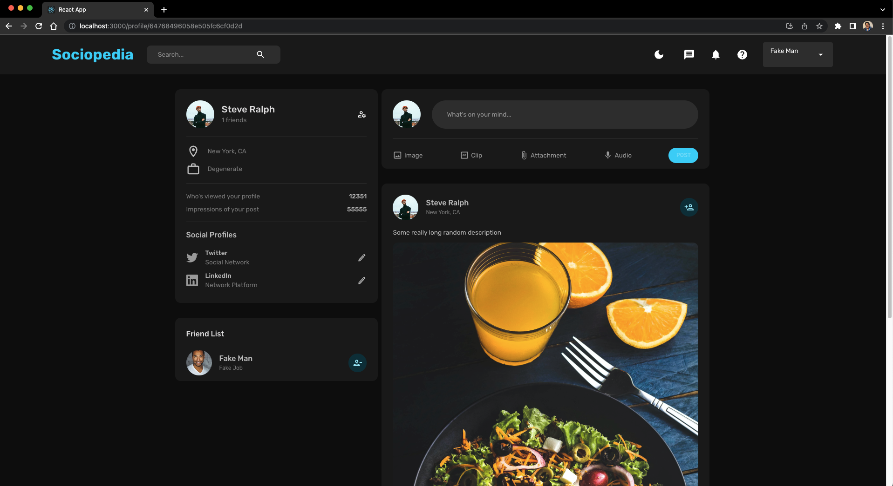
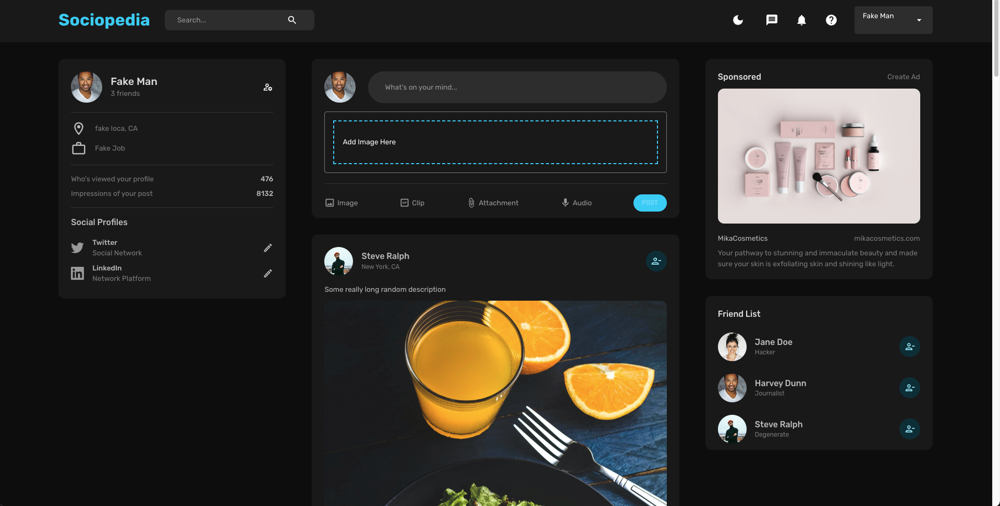

## About the Project



The Fullstack MERN (MongoDB, Express.js, React, Node.js) Social Media Responsive App, utilizing MUI, Redux, Formik, Yup, Axios, JWT, Mongoose, Multer, MongoDB, and Docker, is a comprehensive web application that aims to deliver a seamless and interactive social networking experience. This project combines the power of the MERN stack, along with several additional tools and technologies, to create a feature-rich and scalable social media platform.

The main objective of this project is to build a responsive and user-friendly social media application that encompasses the entire MERN stack. The MERN stack includes MongoDB as the database, Express.js as the backend framework, React for building the user interface, and Node.js as the runtime environment. This stack provides a powerful foundation for creating dynamic and scalable web applications.

Material-UI (MUI), a popular React UI framework, is integrated into the project to provide a wide range of customizable and responsive UI components. MUI ensures a visually appealing and consistent user interface, enhancing the overall user experience throughout the social media app.

Redux, a state management library, is utilized to efficiently manage the application's state and facilitate data flow between React components. By implementing Redux, the app ensures a centralized and predictable state management approach, simplifying the handling of complex data interactions and improving overall app performance.

Formik, a form library, is incorporated to handle form validation, form submission, and form state management. Formik simplifies the process of building and managing forms, ensuring a smooth and error-free user experience when interacting with various input fields.

Yup, a JavaScript schema builder for validation, is used in conjunction with Formik to define and enforce validation rules for the form inputs. Yup ensures that user inputs meet specific criteria, providing a robust and secure data validation mechanism.

Axios, a popular HTTP client, is utilized for making API requests between the frontend and backend. It simplifies the process of sending and receiving data, enabling smooth communication and data exchange.

JWT (JSON Web Tokens) is employed for authentication and authorization purposes. It allows secure and stateless authentication, ensuring that users can securely access protected routes and perform actions within the app.

Mongoose, an Object Data Modeling (ODM) library for MongoDB, provides a straightforward way to interact with the MongoDB database, define data schemas, and perform CRUD operations. Mongoose simplifies the process of working with MongoDB and enables efficient data management.

Multer, a middleware for handling file uploads, is used to manage and process uploaded files in the backend. It simplifies the handling of file uploads, including validation, storage, and retrieval.

MongoDB, a NoSQL document database, serves as the database for storing and retrieving data in a flexible and scalable manner. It offers high performance and scalability, making it an ideal choice for the social media app's data storage needs.

Docker is utilized to containerize the frontend and backend components together, enabling seamless deployment and management of the application's environment. Docker ensures consistency, portability, and scalability, simplifying the deployment process across various platforms and environments.

Key Features:

1. Responsive Design: The social media app is designed to be responsive, ensuring an optimal user experience across various devices, including desktops, tablets, and mobile devices.
2. User Profiles: Users can create personalized profiles, including profile pictures, biographies, and other relevant information.
3. Posts and Feeds: Users can create posts, share content, and engage with other users' posts through likes, comments, and sharing functionalities. A dynamic news feed keeps users up-to-date with the latest activity.
4. Authentication and Authorization: JWT is used for secure user authentication and authorization, allowing users to access protected routes and perform actions within the app based on their permissions.
5. Form Handling and Validation: Formik and Yup are utilized to handle form inputs, validate user inputs, and provide error feedback, ensuring data integrity and a smooth user experience.
6. File Uploads: Multer is integrated to handle file uploads, enabling users to upload and share images or other media content seamlessly.
7. Real-time Interactions: The app facilitates real-time interactions between users, such as instant messaging or real-time notifications, enhancing user engagement and interaction.
8. Data Persistence: MongoDB is used to store and retrieve data, ensuring efficient and scalable data management for the social media app.
9. Material-UI (MUI) Integration: The app leverages MUI's extensive library of customizable and responsive UI components, allowing for the creation of visually appealing and consistent user interfaces.
10. Docker Containerization: Docker is employed to containerize the frontend and backend components together, simplifying deployment, ensuring portability, and enhancing the management of the application's environment.

By combining the power of the MERN stack, Material-UI (MUI), Redux, Formik, Yup, Axios, JWT, Mongoose, Multer, MongoDB, and Docker, this social media app provides a comprehensive solution for building an engaging and scalable social networking platform. Whether you are creating a small community or a large-scale social network, this solution offers the flexibility, functionality, and portability required to create a dynamic and interactive social media experience.

### Built With

- [](https://www.mongodb.com/)
- [](https://expressjs.com/)
- [](https://reactjs.org/)
- [](https://nodejs.org/en/download)
- [](https://www.docker.com/)
- [](https://mui.com/)
- [](https://redux-toolkit.js.org/introduction/getting-started)

## Getting Started

### Prerequisites

To run this project, you will need:

- Node.js installed on your development machine. To install [Node.js](https://nodejs.org/en/download), follow the link. By having Node.js installed you will also have npm installed.
- Any editor of your choice. Personally, I use [Visual Studio Code](https://code.visualstudio.com/download) for all my projects.

### Installation

1. Clone the repo

   ```markdown
   git clone https://github.com/bhaven123/fullstack-socialmedia-mern-app
   ```

2. Install NPM packages

   ```markdown
   npm install
   ```

3. To make sure the server is working properly, enter your MongoDB link, JWT string and the PORT of your choice in an .env file

   ```javascript
   const MONGO_URL = "Your MongoDB connection string";
   const JWT_SECRET = "Secure Token String for Authentication";
   const PORT = "Port you wish to run the server on";
   ```

## Usage

- To run the application with Docker, have your docker daemon running. Then, simply type the following command in a terminal inside the project root folder which has the `docker-compose.yml` file.

  ```markdown
  docker compose up -d
  ```

- To stop the application, type the following command.

  ```markdown
  docker compose down
  ```

### Screenshots







## Contact

- Bhaven Naik - [naikbhaven11@gmail.com](mailto:naikbhaven11@gmail.com) | Portfolio - [https://bhaven-naik.com/](https://bhaven-naik.com/)
- Project Link: [https://github.com/bhaven123/fullstack-socialmedia-mern-app](https://github.com/bhaven123/fullstack-socialmedia-mern-app)

## Acknowledgments

- [Create a New React Project](https://create-react-app.dev/docs/getting-started/)
- [React Router](https://reactrouter.com/en/v6.3.0/getting-started/installation)
- [Redux Persist](https://github.com/rt2zz/redux-persist)
- [React Dropzone](https://react-dropzone.js.org/)
- [Nodemon](https://github.com/remy/nodemon)
- [Axios](https://axios-http.com/)
- [Visual Studio Code](https://code.visualstudio.com/download)
- [Dotenv](https://github.com/motdotla/dotenv)
- [Mongoose](https://github.com/Automattic/mongoose)
- [JWT (JasonWebToken)](https://github.com/auth0/node-jsonwebtoken)
- [Multer ](https://github.com/expressjs/multer)
- [Multer GridFs Storage](https://github.com/devconcept/multer-gridfs-storage)
- [Google Fonts](https://fonts.google.com/)
- [Formik](https://formik.org/docs/overview)
- [Yup](https://github.com/jquense/yup)
- [EdRoh Tutorial - https://www.youtube.com/watch?v=K8YELRmUb5o]()
